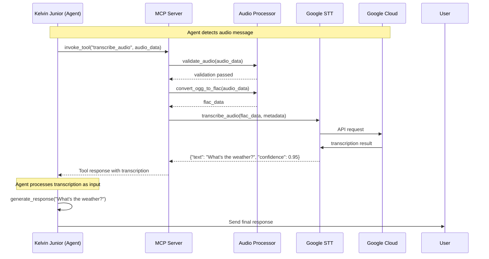
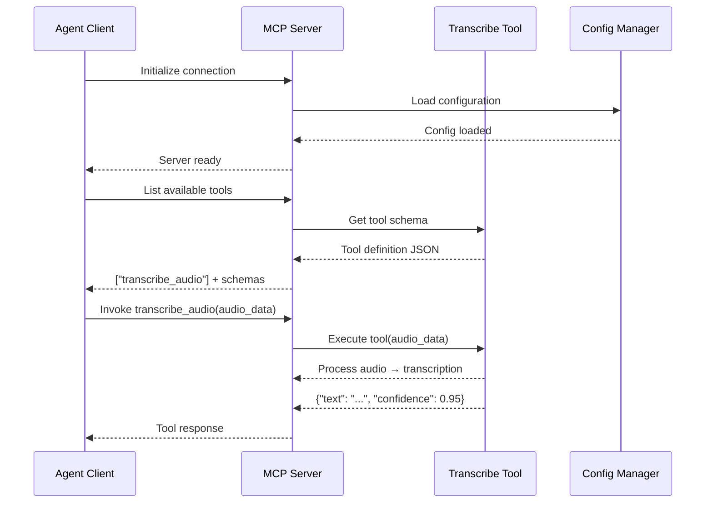
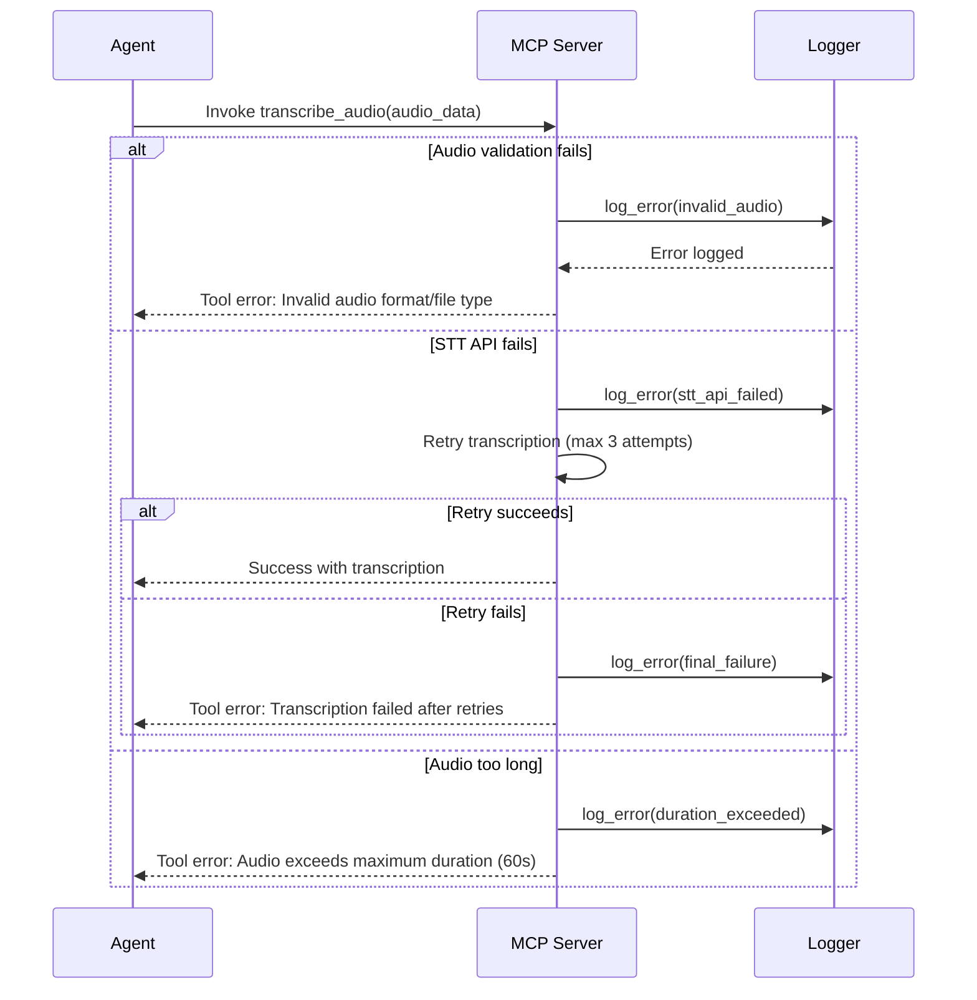

# Claw Auto-Transcriber - Project Specification (MCP SERVER v3.0)

## 🔑 KEY ARCHITECTURE CLARIFICATION

**This is an MCP Server, not a Telegram Bot.**

The server provides a `transcribe_audio` tool that I (Kelvin Junior agent) invoke when I need to transcribe voice/audio messages. The transcription becomes a tool response that I then process as input.

**Architecture Flow:**
1. **I receive/process** Telegram messages (as the agent)
2. **When I detect audio**, I invoke the `transcribe_audio` tool from this MCP server
3. **MCP Server** processes: Audio download → Validation → Google STT → Get transcription
4. **I receive transcription** as tool response
5. **I process transcribed text** as if it were regular user input
6. **I generate and send response** back to Telegram

**MCP Server Role:** Only provides the transcription capability as a tool. The agent handles all Telegram interaction and response generation.

---

## Overview

**Project:** MCP Server - Audio Transcription Service  
**Repository:** https://github.com/k-junior-claw/claw-auto-transcriber  
**Platform:** Python  
**Service Type:** MCP (Model Context Protocol) Server  
**Primary Tool:** `transcribe_audio`  
**Transcription Engine:** Google Cloud Speech-to-Text (STT)  
**Key Innovation:** Voice/audio transcription as a reusable MCP tool

**Architecture:**
- **Server:** Implements MCP protocol, provides transcription tool
- **Client:** I (Kelvin Junior agent) invoke the tool when needed
- **Separation of Concerns:** Server handles audio→text, agent handles user interaction

## 1. Components & Module Design

### Core Components

#### 1.1 MCP Server (`mcp_server.py`) - **NEW PRIMARY COMPONENT**
**Responsibilities:**
- Implement MCP (Model Context Protocol)
- Expose `transcribe_audio` tool
- Handle tool invocations from agents
- Manage tool lifecycle
- Provide tool metadata and schema

**Key Functions:**
- `initialize_server()` - Setup MCP server
- `register_tools()` - Register transcribe_audio tool
- `handle_tool_call()` - Process incoming tool invocations
- `get_tool_schema()` - Return tool definition JSON

#### 1.2 Tool Definition (`tools/transcribe_audio.py`) - **NEW COMPONENT**
**Responsibilities:**
- Define transcribe_audio tool interface
- Specify input parameters (audio file, format, etc.)
- Define output schema (transcription, confidence, etc.)
- Validate tool invocation parameters

**Key Functions:**
- `get_tool_schema()` - Return JSON schema for tool
- `validate_inputs(audio_data, metadata)` - Validate invocation
- `format_response(transcription, confidence)` - Format tool response

#### 1.3 Audio Processor (`audio_processor.py`)
**Responsibilities:**
- Receive audio data from tool invocations
- Validate audio format and compatibility
- Convert audio to Google STT format (FLAC)
- Validate audio quality and duration limits
- Manage temporary audio files (ephemeral)

**Key Functions:**
- `validate_audio(audio_bytes)` - Check format/size
- `convert_ogg_to_flac(ogg_bytes)` - Convert format
- `get_audio_duration(audio_data)` - Check length
- `cleanup_temp_files()` - Remove processed files immediately

#### 1.4 Google STT Integration (`transcriber.py`)
**Responsibilities:**
- Authenticate with Google Cloud using service account credentials
- Send audio to Google Cloud Speech-to-Text API
- Parse transcription responses
- Handle API errors and retries
- Extract transcription text and confidence

**Key Functions:**
- `initialize_stt_client()` - Setup Google Cloud connection
- `transcribe_audio(audio_data, metadata)` - Main transcription function
- `parse_transcription_response(response)` - Extract text & confidence

#### 1.5 Configuration Manager (`config.py`)
**Responsibilities:**
- Load environment variables
- Manage Google Cloud credentials
- Provide configuration defaults
- Validate required settings

**Key Variables:**
- `GOOGLE_CLOUD_PROJECT_ID`
- `GOOGLE_APPLICATION_CREDENTIALS_PATH`
- `SUPPORTED_AUDIO_FORMATS`
- `MAX_AUDIO_DURATION` (default: 60 seconds)
- `TEMP_AUDIO_DIR`

#### 1.6 Logger Module (`logger.py`)
**Responsibilities:**
- Application-wide logging configuration
- Structured logging for debugging
- Error tracking and reporting
- Performance metrics logging
- Ensure NO audio content is logged (privacy)

### Secondary Components

#### 1.7 Testing Suite (`tests/`)
**Purpose:** Comprehensive testing of all modules

**Test Categories:**
- Unit tests for each component (80% coverage goal with pytest)
- Integration tests for MCP tool flow
- Mock tests for Google Cloud STT
- Tool invocation and response tests
- Error handling tests

#### 1.8 Documentation (`docs/`)
**Purpose:** User and developer documentation

**Contents:**
- Installation guide
- Configuration instructions
- MCP usage examples
- Tool invocation examples
- API documentation

## 2. Interaction Flow - MCP Tool Invocation

### 2.1 MCP Tool Invocation Sequence (PRIMARY FLOW)



**Flow Description:**
1. **I (agent)** detect a voice message from user on Telegram
2. **I invoke** `transcribe_audio` tool on MCP Server with audio data
3. **MCP Server** validates and converts the audio
4. **MCP Server** sends audio to Google Cloud STT
5. **Google Cloud** returns transcription (e.g., "What's the weather?")
6. **MCP Server** formats and returns tool response to me
7. **I (agent)** receive transcription and treat as user input
8. **I process** the transcribed text like a regular message
9. **I generate and send** appropriate response back to user

**Key Difference:** Unlike a bot, the MCP server **never interacts directly with Telegram**. It only provides the transcription capability that I invoke as a tool.

### 2.2 MCP Protocol Implementation Flow



### 2.3 Error Handling in MCP Tool Flow



## 3. Data Design

### 3.1 MCP Tool Schema (JSON)

```json
{
  "tool_name": "transcribe_audio",
  "description": "Transcribe audio/voice messages to text using Google Cloud Speech-to-Text",
  "parameters": {
    "audio_data": {
      "type": "string",
      "format": "base64",
      "description": "Base64-encoded audio file (OGG format from Telegram)"
    },
    "metadata": {
      "type": "object",
      "properties": {
        "original_format": {"type": "string", "enum": ["ogg", "mp3", "wav"]},
        "duration_seconds": {"type": "number"},
        "user_id": {"type": "string"},
        "message_id": {"type": "string"}
      }
    }
  },
  "response_schema": {
    "transcription": {
      "type": "string",
      "description": "The transcribed text from the audio"
    },
    "confidence": {
      "type": "number",
      "minimum": 0,
      "maximum": 1,
      "description": "Confidence score for the transcription (0.0 to 1.0)"
    },
    "language": {
      "type": "string",
      "description": "Detected language code (e.g., 'en-US')"
    },
    "duration": {
      "type": "number",
      "description": "Audio duration in seconds"
    }
  },
  "requirements": {
    "max_duration": 60,
    "supported_formats": ["audio/ogg", "audio/mp3", "audio/wav", "audio/flac"],
    "api_key_required": true
  }
}
```

### 3.2 Configuration Data (.env file)

```bash
# Google Cloud
GOOGLE_CLOUD_PROJECT_ID=your-project-id
GOOGLE_APPLICATION_CREDENTIALS=path/to/service-account.json

# MCP Server
MCP_SERVER_HOST=localhost
MCP_SERVER_PORT=8765
MCP_SERVER_NAME=claw-auto-transcriber

# Application Settings
MAX_AUDIO_DURATION=60  # seconds
TEMP_AUDIO_DIR=/tmp/claw_transcriber
LOG_LEVEL=INFO

# Security
REQUIRE_AUTHENTICATION=true
RATE_LIMIT_PER_MINUTE=60
```

### 3.3 MCP Server State (Runtime, Ephemeral)

**Storage:** In-memory only (no persistence between server restarts)  
**Lifecycle:** Server start → Tools registered → Connections handled → Server stop

```json
{
  "server_id": "claw-transcriber-001",
  "start_time": "2026-02-01T12:00:00Z",
  "active_connections": 3,
  "tools_registered": ["transcribe_audio"],
  "total_invocations": 157,
  "errors_in_session": 2
}
```

### 3.4 Logging Data Structure (for debugging/monitoring)

```json
{
  "timestamp": "2026-02-01T12:15:30Z",
  "level": "INFO",
  "component": "mcp_server",
  "event": "tool_invoked",
  "metadata": {
    "tool_name": "transcribe_audio",
    "connection_id": "conn_abc123",
    "audio_duration": 3.2,
    "processing_time_ms": 2150
  }
}
```

**Privacy:** No audio content or transcription text is logged. Only metadata for debugging.

### 3.5 Tool Invocation Metadata (Temporary, per-call)

**Storage:** In-memory during tool execution only  
**Lifecycle:** Tool call starts → Created → Processing → Response sent → Discarded

```json
{
  "invocation_id": "invoke_789abc",
  "connection_id": "conn_abc123",
  "tool_name": "transcribe_audio",
  "received_at": "2026-02-01T12:15:30Z",
  "audio_size_bytes": 45000,
  "audio_format": "audio/ogg",
  "processing_time_ms": 2150,
  "status": "completed",
  "error": null
}
```

## 4. Implementation Plan (Revised for MCP Architecture)

### Phase 1: Core Module Development (High Priority)

**Duration:** 3-4 days

**Tasks:**
1. **Setup MCP Server Framework** (`mcp_server.py`)
   - Install MCP Python SDK
   - Create server initialization
   - Implement basic tool registration
   - Setup connection handling

2. **Config Module** (`config.py`)
   - Load environment variables
   - Validate Google Cloud credentials
   - Provide configuration defaults

3. **Logger Module** (`logger.py`)
   - Set up structured logging
   - Configure handlers
   - Add performance timing

4. **Audio Processor** (`audio_processor.py`)
   - Audio validation (format, size, duration)
   - OGG → FLAC conversion for Google STT
   - Implement ephemeral file handling
   - Add privacy-preserving cleanup

### Phase 2: Google STT Integration (High Priority)

**Duration:** 2-3 days

**Tasks:**
1. **Google STT Client** (`transcriber.py`)
   - Initialize Google Cloud Speech client
   - Create transcription function
   - Implement error handling and retries
   - Parse transcription responses
   - Extract text and confidence scores

2. **Test STT Integration**
   - Test with sample audio files
   - Verify transcription quality
   - Test error scenarios
   - Measure latency

### Phase 3: Tool Definition & Integration (High Priority)

**Duration:** 2-3 days

**Tasks:**
1. **Tool Definition** (`tools/transcribe_audio.py`)
   - Define transcribe_audio tool schema
   - Specify input parameters
   - Define output/response format
   - Add input validation

2. **Integrate Tool with MCP Server**
   - Register tool with MCP server
   - Implement tool invocation handler
   - Wire audio processor → transcriber → response
   - Test tool invocation flow

3. **Tool Response Handler**
   - Format transcription as tool response
   - Add metadata (confidence, duration, etc.)
   - Handle errors gracefully

### Phase 4: MCP Server Implementation & Testing

**Duration:** 3-4 days

**Tasks:**
1. **Implement MCP Protocol**
   - Tool discovery endpoint
   - Tool invocation handling
   - Error response formatting
   - Connection management

2. **Server Lifecycle Management**
   - Server start/stop
   - Graceful shutdown
   - Signal handling

3. **Testing**
   - Unit tests (80% coverage with pytest)
   - Integration tests (MCP tool flow)
   - Mock Google Cloud STT
   - Test various audio formats/sizes

4. **Security Testing**
   - Input validation
   - Rate limiting
   - No audio/logging in production

### Phase 5: Documentation & Deployment

**Duration:** 2-3 days

**Tasks:**
1. **Documentation** (`README.md`, `docs/`)
   - MCP server setup instructions
   - Configuration guide
   - Tool usage examples
   - Agent integration examples
   - API reference

2. **Setup Documentation** (`docs/setup.md`)
   - Google Cloud project creation
   - Service account setup
   - Environment configuration
   - MCP client configuration

3. **Deployment Configuration**
   - Docker setup (optional)
   - Process manager configuration
   - Monitoring setup
   - Log aggregation

## 5. MCP-Specific Considerations (NEW SECTION)

### 5.1 MCP Protocol Compliance

**Standards:**
- Follow Model Context Protocol specification
- Use official MCP SDK for Python
- Support both STDIO and TCP transports
- Implement tool discovery mechanism
- Follow JSON-RPC 2.0 for messages

**Tool Registration:**
```json
{
  "tools": [
    {
      "name": "transcribe_audio",
      "description": "Transcribe audio/voice to text using Google Cloud STT",
      "input_schema": {
        "type": "object",
        "properties": {
          "audio_data": {"type": "string", "format": "base64"},
          "metadata": {"type": "object"}
        },
        "required": ["audio_data"]
      }
    }
  ]
}
```

### 5.2 Tool Invocation Flow

**From Agent Perspective:**
```python
# Agent invokes the tool
tool_response = await mcp_client.call_tool(
    "transcribe_audio",
    {
        "audio_data": base64_audio,
        "metadata": {"format": "ogg", "duration": 3.2}
    }
)

# Agent receives and processes response
transcription = tool_response["transcription"]
confidence = tool_response["confidence"]
# ... process transcription as input ...
```

### 5.3 Security & Access Control

**Authentication:**
- MCP server may require authentication token
- Agent must provide valid credentials
- Rate limiting per connection
- Audit logging for tracking usage

**Input Validation:**
- Validate all audio data before processing
- Sanitize metadata to prevent injection
- Check file size limits
- Reject unsupported formats

### 5.4 Performance & Resource Management

**Optimization:**
- Reuse Google Cloud STT client connections
- Keep audio files in memory (no disk I/O when possible)
- Parallel processing for multiple concurrent tool calls
- Connection pooling

**Resource Limits:**
- Maximum concurrent tool invocations: 10
- Audio size limit: 10MB per invocation
- Timeout per invocation: 30 seconds
- Memory limit: 512MB per audio file

## 6. File Structure (Updated for MCP Server)

```
claw-auto-transcriber/
├── .env.template                          # Environment variables template
├── .gitignore                            # Git ignore patterns
├── requirements.txt                      # Python dependencies (including mcp SDK)
├── README.md                             # Project overview (MCP server)
├── PROJECT_SPEC.md                       # This specification (v3.0)
├── mcp_server.py                         # **NEW: MCP server implementation**
├── tools/
│   ├── __init__.py
│   └── transcribe_audio.py               # **NEW: Tool definition**
├── audio_processor.py                    # Audio handling
├── transcriber.py                        # Google STT integration
├── config.py                             # Configuration management
├── logger.py                             # Logging utilities
├── tests/
│   ├── __init__.py
│   ├── test_mcp_server.py                # **NEW: MCP server tests**
│   ├── test_transcribe_tool.py           # **NEW: Tool invocation tests**
│   ├── test_audio_processor.py
│   ├── test_transcriber.py
│   └── fixtures/                         # Test audio files (sample OGGs)
└── docs/
    ├── setup.md                          # Setup instructions
    ├── mcp_usage.md                      # **NEW: MCP usage guide**
    └── tool_reference.md                 # **NEW: Tool API reference**
```

## 7. Testing Strategy (80% Coverage with pytest)

### 7.1 Unit Tests (Individual Components)
- **MCP Server:** Tool registration, request handling, response formatting
- **Tool Definition:** Schema validation, input/output formatting
- **Audio Processor:** OGG validation, FLAC conversion, cleanup
- **Google STT Integration:** API calls, response parsing, error handling
- **Configuration:** .env loading, validation
- **Logging:** Log structure, metadata inclusion

### 7.2 Integration Tests (Component Interactions)
- MCP tool invocation → Audio processing → STT → Response flow
- Concurrent tool calls (stress test)
- Error propagation through layers
- Audio validation before STT

### 7.3 End-to-End Tests (MCP Protocol)
- Full MCP tool invocation cycle
- JSON-RPC message format compliance
- Tool discovery functionality
- Error response format

## 8. Security & Best Practices

### 8.1 Credential Management
- **NEVER commit** `.env` file or service account keys
- Use environment variables for all secrets
- No audio/transcription logging in production
- Rotate credentials regularly

### 8.2 MCP Server Security
- Require authentication tokens
- Implement rate limiting (60 calls/minute per client)
- Validate all inputs
- Sanitize metadata to prevent injection
- Log only metadata (no audio content)

### 8.3 Privacy & Data Protection
- **Ephemeral processing:** Audio deleted immediately after transcription
- **No storage:** Transcriptions not stored (only returned as tool response)
- **Opt-in logging:** Content logging only in debug mode
- **Secure transport:** Use TLS for MCP connections

## 9. Deployment & Operations

### 9.1 Running the MCP Server

```bash
# Create virtual environment
python3 -m venv venv
source venv/bin/activate

# Install dependencies
pip install -r requirements.txt

# Set environment variables
cp .env.template .env
# Edit .env with actual credentials

# Run server
python mcp_server.py
```

### 9.2 Client (Agent) Configuration

```python
# Agent connects to MCP server
from mcp import Client

client = Client("http://localhost:8765")
client.connect()

# List available tools
tools = client.list_tools()

# Invoke transcription tool
response = client.invoke_tool(
    "transcribe_audio",
    {
        "audio_data": base64_audio,
        "metadata": {"format": "ogg", "duration": 3.2}
    }
)

transcription = response["transcription"]
```

### 9.3 Docker Deployment (Optional)

```dockerfile
FROM python:3.12-slim

WORKDIR /app
COPY requirements.txt .
RUN pip install -r requirements.txt

COPY . .
EXPOSE 8765

CMD ["python", "mcp_server.py"]
```

## 10. Future Enhancements

**Out of Scope:**
- Support for longer audio (>60 seconds)
- Batch transcription (multiple audio files)
- Real-time streaming transcription
- Speaker diarization
- Multi-language support in single audio
- Audio enhancement/cleanup preprocessing

---

**Last Updated:** 2026-02-01  
**Version:** 3.0 (MCP SERVER)  
**Status:** Ready for Implementation  
**Review:** Updated spec sent via email for your review