# Claw Auto-Transcriber - Project Specification (REVISED)

## 🔑 KEY CLARIFICATION

**Voice messages are an INPUT MODALITY, not for returning transcriptions.**

This bot treats voice messages as an alternative way for users to communicate with it. After transcribing, the text is processed as bot input (like a regular text message), and the bot responds with its own generated response—not the transcription.

**Revised Flow:**
1. User sends voice message to Telegram
2. Bot downloads audio (OGG format)
3. Audio processor validates & converts
4. Transcriber sends to Google Cloud STT
5. Google Cloud returns transcription
6. **Bot treats transcription as USER INPUT** (like a regular text message)
7. Bot processes transcribed text (commands, queries, etc.)
8. Bot generates appropriate response
9. Bot sends response back to Telegram

---

## Overview

**Project:** Auto-transcriber for voice recordings on Telegram channel  
**Repository:** https://github.com/k-junior-claw/claw-auto-transcriber  
**Platform:** Python  
**Transcription Service:** Google Cloud Speech-to-Text (STT)  
**Primary Channel:** Telegram  
**Key Innovation:** Voice messages as alternative input modality

## 1. Components & Module Design

### Core Components

#### 1.1 Telegram Bot Handler (`telegram_bot.py`)
**Responsibilities:**
- Initialize and manage Telegram bot connection
- Receive voice messages from Telegram channel
- Process audio file downloads from Telegram
- **Handle transcribed text as bot input** (process like regular text messages)
- Generate appropriate bot responses based on transcribed content
- Send bot responses back to Telegram
- Handle user commands and interactions

**Key Functions:**
- `start_bot()` - Initialize bot listener
- `download_voice_message(msg)` - Download audio from Telegram
- `process_transcribed_input(text, user_id, chat_id)` - **NEW: Handle transcription as input**
- `route_to_handler(transcribed_text)` - **NEW: Route to appropriate command/query handler**
- `send_response(chat_id, response)` - Send bot's generated response
- `handle_error(error_msg, chat_id)` - Error reporting

**Key Change:** Instead of `send_transcription()`, we now have `process_transcribed_input()` and `send_response()`

#### 1.2 Google Cloud STT Integration (`transcriber.py`)
**Responsibilities:**
- Authenticate with Google Cloud using service account credentials
- Convert audio files to formats compatible with STT API
- Send audio to Google Cloud Speech-to-Text
- Parse transcription responses
- Handle API errors and retries

**Key Functions:**
- `initialize_stt_client()` - Setup Google Cloud connection
- `transcribe_audio(audio_file_path)` - Main transcription function
- `convert_audio_format(input_path, output_path)` - Format conversion
- `parse_transcription_response(response)` - Extract text from API response

#### 1.3 Audio Processing Module (`audio_processor.py`)
**Responsibilities:**
- Verify audio file format and compatibility
- Convert Telegram audio (OGG) to Google Cloud STT compatible format (FLAC)
- Validate audio quality and duration limits
- Extract audio metadata
- Manage temporary audio files
- **Ephemeral processing: immediately delete audio after transcription**

**Key Functions:**
- `validate_audio(file_path)` - Check format/size constraints
- `convert_ogg_to_flac(ogg_path, flac_path)` - Convert format
- `get_audio_duration(file_path)` - Check length
- `cleanup_temp_files()` - Remove processed files immediately

**Privacy Note:** Audio files are processed ephemerally and deleted immediately after transcription. No audio storage.

#### 1.4 Input Processing Router (`input_router.py`) - **NEW COMPONENT**
**Responsibilities:**
- Route transcribed text to appropriate bot handlers
- Integrate with existing command/query parsing system
- Validate transcribed input before processing (security)
- Handle both voice and text inputs uniformly

**Key Functions:**
- `route_input(text, user_id, chat_id)` - Route to appropriate handler
- `validate_input(text)` - Security validation (prevent injection attacks)
- `is_command(text)` - Determine if input is a bot command
- `extract_query(text)` - Parse natural language queries

#### 1.5 Configuration Manager (`config.py`)
**Responsibilities:**
- Load and validate environment variables
- Manage Google Cloud credentials
- Store Telegram bot token
- Provide configuration defaults

**Key Variables:**
- `TELEGRAM_BOT_TOKEN`
- `GOOGLE_CLOUD_PROJECT_ID`
- `GOOGLE_APPLICATION_CREDENTIALS_PATH`
- `SUPPORTED_AUDIO_FORMATS`
- `MAX_AUDIO_DURATION` (default: 60 seconds)

#### 1.6 Logger Module (`logger.py`)
**Responsibilities:**
- Application-wide logging configuration
- Structured logging for debugging
- Error tracking and reporting
- Performance metrics logging
- Ensure NO audio content is logged (privacy)

### Secondary Components

#### 1.7 Testing Suite (`tests/`)
**Purpose:** Comprehensive testing of all modules

**Test Categories:**
- Unit tests for each component
- Integration tests for voice→transcription→response flow
- Mock tests for external services (Telegram, Google Cloud)
- Command routing tests for transcribed text
- Security validation tests

#### 1.8 Documentation (`docs/`)
**Purpose:** User and developer documentation

**Contents:**
- Installation guide
- Configuration instructions
- Usage examples with voice messages
- API documentation
**Voice Input Modality explanation

## 2. Interaction Flow

### 2.1 Voice Message as Input Modality (PRIMARY FLOW)

```mermaid
sequenceDiagram
    participant User as Telegram User
    participant Bot as Telegram Bot
    participant AudioProc as Audio Processor
    participant Transcriber as Google STT
    participant Router as Input Router
    participant Handler as Bot Handler
    participant Response as Response Generator

    User->>Bot: Send voice message
    Bot->>Bot: receive_voice_message()
    Bot->>Bot: download_audio()
    Bot->>AudioProc: validate_and_convert(audio_ogg)
    AudioProc-->>Bot: audio_flac
    Bot->>Transcriber: transcribe_audio(audio_flac)
    Transcriber->>Google: API request
    Google->>Transcriber: transcription text
    Transcriber-->>Bot: "What's the weather?"
    Bot->>Router: route_input("What's the weather?", user_id)
    Router->>Handler: process_query("weather")
    Handler->>WeatherAPI: get_weather()
    WeatherAPI->>Handler: weather_data
    Handler->>Response: format_response(weather_data)
    Response-->>Bot: "It's 72°F and sunny"
    Bot->>User: Send text response
    Note over Bot,AudioProc: cleanup_temp_audio()
```



**Flow Description:**
1. User sends voice message to Telegram bot
2. Bot downloads audio in OGG format
3. Audio processor validates and converts to FLAC
4. Transcriber sends FLAC to Google Cloud STT
5. Google Cloud returns transcription text
6. **Bot treats transcription as user input**
7. Input router determines if it's a command or query
8. Appropriate handler processes the request
9. Response generator creates bot's answer
10. Bot sends response back to user
11. Temporary audio files are cleaned up

### 2.2 Authentication Flow


### 2.3 Error Handling Flow


## 3. Data Design

### 3.1 Configuration Data (.env file)

```bash
# Telegram
TELEGRAM_BOT_TOKEN=your_telegram_bot_token_here

# Google Cloud
GOOGLE_CLOUD_PROJECT_ID=your_project_id
GOOGLE_APPLICATION_CREDENTIALS=path/to/service_account.json

# Application Settings
MAX_AUDIO_DURATION=60  # seconds
LOG_LEVEL=INFO
TEMP_AUDIO_DIR=/tmp/claw_transcriber
```

### 3.2 Transcription Input Schema (Temporary, Ephemeral)

**Storage:** In-memory only (not persisted)  
**Lifecycle:** Created → Routed → Processed → Discarded

```json
{
  "message_id": "msg_12345",
  "user_id": 987654321,
  "chat_id": 123456789,
  "transcribed_text": "What's the weather?",
  "original_audio_id": "AwACAgQAAxkB...",
  "audio_duration": 3.2,
  "transcribed_at": "2026-02-01T10:30:00Z",
  "confidence": 0.95
}
```

**Note:** This data is treated exactly like a regular text message once transcribed. It routes through the same command/query parsing system.

### 3.3 Logging Data Structure (Privacy-Aware)

```json
{
  "timestamp": "2026-02-01T10:30:00Z",
  "level": "INFO",
  "module": "telegram_bot",
  "function": "handle_voice_message",
  "message": "Voice message processed successfully",
  "metadata": {
    "user_id": 987654321,
    "audio_duration": 3.2,
    "processing_time_ms": 2150,
    "transcription_confidence": 0.95
  }
}
```

**Privacy:** No audio content or transcription text is logged. Only metadata.

### 3.4 Telegram Message Context Schema

```json
{
  "message_id": 12345,
  "chat_id": 123456789,
  "user_id": 987654321,
  "timestamp": "2026-02-01T10:29:30Z",
  "message_type": "voice",  // or "text" after transcription
  "original_audio_id": "AwACAgQAAxkB...",
  "audio_duration": 3.2,
  "mime_type": "audio/ogg"
}
```

### 3.5 Bot Response Schema

```json
{
  "response_id": "resp_12345",
  "to_message_id": 12345,
  "user_id": 987654321,
  "chat_id": 123456789,
  "response_text": "It's 72°F and sunny today!",
  "generated_at": "2026-02-01T10:30:02Z",
  "processing_time_ms": 2500
}
```

### 3.6 Temporary Audio Files (Ephemeral)

**Storage Location:** `/tmp/claw_transcriber/`  
**File Naming:** `audio_{timestamp}_{user_id}_{message_id}.{ext}`  
**Auto-cleanup:** Files deleted immediately after transcription (within milliseconds)

**Privacy Guarantee:** No audio files persist beyond the immediate transcription request.

## 4. Implementation Plan

### Phase 1: Project Setup & Configuration (High Priority)

**Duration:** 1-2 days

**Tasks:**
1. ✅ Repository already cloned and on GitHub
2. ✅ PROJECT_SPEC.md created and committed
3. Create Python virtual environment with uv
4. Install required packages:
   - `python-telegram-bot`
   - `google-cloud-speech`
   - `pydub` (for audio conversion)
   - `python-dotenv`
   - `structlog` (for logging)
5. Create `.env.template` file with all required variables
6. Set up `.gitignore` to exclude `.env` and credentials
7. Initialize logger module

### Phase 2: Core Module Development (High Priority)

**Duration:** 3-4 days

**Tasks:**
1. **Config Module** (`config.py`)
   - Load environment variables
   - Validate required settings
   - Provide configuration defaults
   
2. **Logger Module** (`logger.py`)
   - Set up structured logging
   - Configure file and console handlers
   - Add performance timing functions
   
3. **Audio Processor** (`audio_processor.py`)
   - Implement audio validation
   - Create conversion functions (OGG → FLAC)
   - Add duration checking
   - Implement immediate cleanup after transcription
   - Add privacy-preserving processing
   
4. **Google STT Client** (`transcriber.py`)
   - Initialize Google Cloud client
   - Create audio upload and transcription functions
   - Implement error handling and retries
   - Parse and format responses

5. **Input Router** (`input_router.py`) - **NEW COMPONENT**
   - Create routing logic for transcribed text
   - Integrate with existing command/query system
   - Implement validation for security
   - Add injection attack prevention

### Phase 3: Telegram Bot Integration (High Priority)

**Duration:** 3-4 days (increased due to new requirements)

**Tasks:**
1. **Bot Handler** (`telegram_bot.py`)
   - Initialize Telegram bot
   - Set up voice message detection handler
   - Implement audio download functionality
   - **NEW: Call transcription flow on voice messages**
   - **NEW: Process transcribed text through input router**
   - **NEW: Route to existing command/query handlers**
   - Send final bot response back to user
2. Connect bot to main application loop
3. Update existing command handlers to work with both text and transcribed input
4. Add user-friendly error messages
5. Test complete flow: Voice → Transcription → Processing → Response

### Phase 4: Integration & Testing (High Priority)

**Duration:** 3-4 days (increased due to complexity)

**Tasks:**
1. **Main Application** (`main.py`)
   - Wire all components together
   - Create application entry point
   - Add graceful shutdown handling
2. **Integration Testing**
   - Test full voice message flow
   - Mock external APIs for testing
   - Performance testing with various audio lengths
   - Test command parsing from transcribed text
   - Test error handling throughout flow
3. **Security Testing**
   - Validate input sanitization
   - Test injection attack prevention
   - Verify privacy measures (no audio/logging)

### Phase 5: Documentation & Deployment (Medium Priority)

**Duration:** 2-3 days

**Tasks:**
1. **Documentation Updates** (`README.md`, `PROJECT_SPEC.md`)
   - Update with voice input modality explanation
   - Add usage examples with voice messages
   - Document privacy guarantees
   - Add security considerations
2. **Setup Guide** (`docs/setup.md`)
   - Detailed setup instructions
   - Google Cloud project configuration
   - Telegram bot creation guide
   - **NEW: Voice message handling guide**
3. **Testing Documentation** (`docs/testing.md`) - **NEW**
   - Voice message test scenarios
   - Command parsing from transcription tests
4. **Deploy** (future)
   - Deployment configuration
   - Docker setup (optional)
   - Monitoring setup

## 5. Voice Input Modality (NEW SECTION)

### 5.1 Concept

Voice messages are treated as a **first-class input modality** alongside text messages. Users can speak their commands/queries naturally, and the bot will process the transcribed text exactly as if it were typed.

**Examples:**
- Voice: *"What's the weather today?"* → Bot queries weather and responds
- Voice: *"Remind me to call John at 3 PM"* → Bot creates reminder
- Voice: *"What's on my calendar tomorrow?"* → Bot checks calendar

**NOT:**
- Voice: *"Meeting notes from today"* → X Bot returns transcription (OLD WAY)
- Voice: *"Meeting notes from today"* → ✓ Bot summarizes meeting and responds (NEW WAY)

### 5.2 Architecture Benefits

1. **Extends Existing Bot Capabilities** - No need to rebuild command system
2. **Natural User Experience** - Speak naturally, get intelligent responses
3. **Privacy-Preserving** - No audio/transcription storage
4. **Security** - Same input validation as text messages
5. **Accessibility** - Hands-free interaction for users

### 5.3 Implementation Notes

- Transcribed text passes through the same routing system as regular text
- Existing commands/queries work identically with voice input
- Response generation uses existing business logic
- Audio is immediately discarded after transcription
- No special handling needed for most commands

## 6. File Structure

```
claw-auto-transcriber/
├── .env.template                          # Environment variables template
├── .gitignore                            # Git ignore patterns
├── requirements.txt                      # Python dependencies
├── README.md                             # Project overview
├── PROJECT_SPEC.md                       # This specification
├── CURSOR_TOOL_DOCS.md                   # Cursor CLI documentation
├── main.py                               # Application entry point
├── config.py                             # Configuration management
├── logger.py                             # Logging utilities
├── telegram_bot.py                       # Telegram integration
├── audio_processor.py                    # Audio handling
├── transcriber.py                        # Google STT integration
├── input_router.py                       # **NEW: Routes transcribed input**
├── tests/
│   ├── __init__.py
│   ├── test_telegram_bot.py
│   ├── test_audio_processor.py
│   ├── test_transcriber.py
│   ├── test_input_router.py              # **NEW**
│   └── fixtures/                         # Test audio files
└── docs/
    ├── setup.md                          # Setup instructions
    ├── architecture.md                   # Architecture details
    └── voice_input.md                    # **NEW: Voice input guide**
```

## 7. Security & Best Practices

### 7.1 Credential Management
- **NEVER commit** `.env` file or service account keys
- Use `.env` or environment variables for all secrets
- Store sensitive files outside version control
- Rotate credentials regularly

### 7.2 Telegram Bot Security
- Use webhook URLs with random tokens
- Validate incoming requests
- Rate limit requests to prevent abuse
- Validate transcribed input before processing (prevent injection)

### 7.3 Google Cloud Security
- Use service accounts with minimal permissions
- Follow principle of least privilege
- Monitor API usage and costs

### 7.4 Code Quality
- Use type hints throughout
- Write docstrings for all functions
- Keep functions small and focused
- Follow PEP 8 style guide

### 7.5 Privacy & Data Protection
- **No audio storage** - Ephemeral processing only
- **No transcription storage** - Processed as input then discarded
- **Minimal logging** - Metadata only, no content
- **Automatic cleanup** - All temp files deleted immediately

## 8. Testing Strategy

### 8.1 Unit Tests (70% coverage goal)
- Test each module independently
- Mock external dependencies (Telegram, Google Cloud)
- Test edge cases and error conditions
- Test audio validation and conversion
- Test transcription parsing
- Test input routing and validation

### 8.2 Integration Tests
- Test full voice message flow: Voice → Transcription → Response
- Mock external APIs for testing
- Performance testing with various audio lengths (1s, 10s, 30s, 60s)
- Test command parsing from transcribed text
- Test error handling throughout flow
- Test security validation

### 8.3 Voice Input Specific Tests (NEW)
- Test commands spoken naturally
- Test queries with different accents/intonations
- Test background noise handling
- Test multi-turn conversations with voice
- Test mixed text + voice interactions

### 8.4 Security Tests (NEW)
- Validate input sanitization for transcribed text
- Test injection attack prevention
- Verify privacy measures (no audio/logging)
- Test rate limiting

## 9. Future Enhancements (Out of Scope)

- Support for longer audio (>60 seconds)
- Speaker diarization
- Multi-language support
- Voice activity detection (skip silence)
- Batch processing of multiple audio files
- Voice command shortcuts

---

**Last Updated:** 2026-02-01  
**Version:** 2.0 (REVISED)  
**Status:** Ready for Review (with KEY CLARIFICATION incorporated)